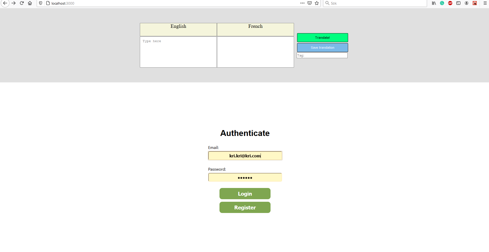

## WordBank (Group 7):

### Project description:

WordBank was designed and implemented in order to help people store their most important translations and sort them depending on context. All of this is done to make it easier for a person learning a new language to gradually expand their vocabulary. 

### Progress made:

These features have been implemented so far: signup/signin page, sidebar, translate functionality with Google API, trello-like boards to save important phrases. 

### Planning to do:

Features that are planned to be implemented: Drag & drop functionality, etc.

### File structure

Files are structured into the folders: models, presenters, views. In views we have an additional
folder called components for parts in the application that is frequently used e.g. buttons, img
tags, text. 
 
 
Utils = Utilities
src/index.js = entry point for the application
src/App.js = routing, modal creation, etc.
src/theme.js & src/style.js = shared styling and colors for the application
src/firebase.js = firebase connection established
